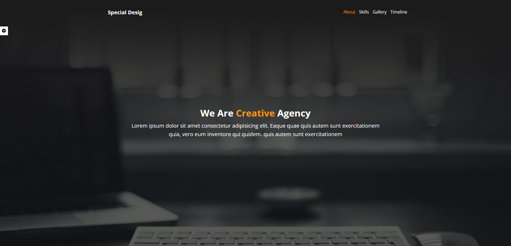

<h1 align="center">Website Project | Special Design</h1>

  <h3>
    <a href="https://bashar-omar.github.io/Special-Design/">
      Demo
    </a>
  </h3>

## Table of Contents

- [Overview](#overview)
  - [Built With](#built-with)
- [Contact](#contact)

## Overview

Training Website Project

- Tool Box You Can Customize The Website :
- You Can Change The Main Color.
- You Can Enable And Disable The Random Background.
- You Can Show And Hide The Navigation Bullets.

All The Data You Ganna Change Thay Well Be Save In the Local Storage

Option For Reset The Options And Clear The Local Storage

## Built With

- <h4>HTML</h4>
- <h4>CSS</h4>
- <h4>Java Script</h4>

## Contact

- Website [Incodey](https://incodey.com/)
- GitHub [Bashar-Omar](https://github.com/Bashar-Omar)
- linkedin [bashar-omar](https://www.linkedin.com/in/bashar-omar/)
